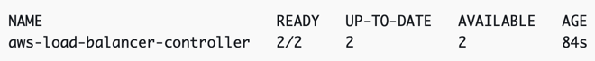
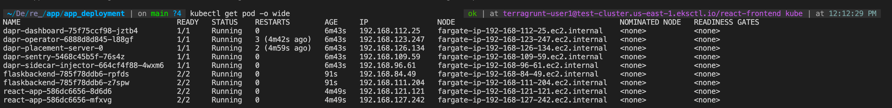
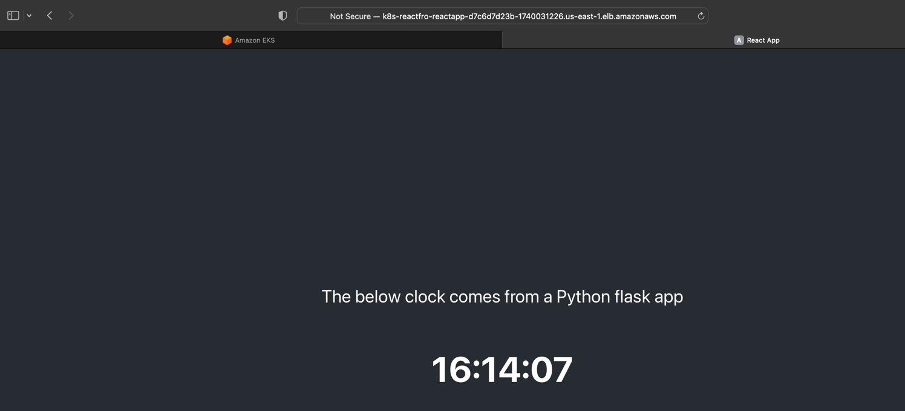

# Prerequisites
1. `kubectl` – A command line tool for working with Kubernetes clusters
2. `eksctl` – A command line tool for working with EKS clusters that automates many individual tasks
3. `helm` - Helm package manager for Kubernetes helps you install and manage applications on your Kubernetes cluster.
4. Required IAM permissions – The IAM security principal that you're using must have permissions to work with Amazon EKS IAM roles and service linked roles, AWS CloudFormation, and a VPC and related resources.

# PRE-SETUP: Install VPC, EKS Cluster, IAM OIDC, and AWS Load Balancer Controller add-on
## Creating a VPC for Amazon EKS cluster
[VPC Cloud Formation](https://docs.aws.amazon.com/eks/latest/userguide/creating-a-vpc.html)

## Amazon EKS cluster
[EKS Cluster Install](https://docs.aws.amazon.com/eks/latest/userguide/getting-started.html)
###### 1. Install an EKS Cluster
`eksctl create cluster --name my-cluster --region region-code --fargate`
###### 2. View cluster nodes
`kubectl get nodes -o wide`
###### 3. Get VPC ID
`eksctl get cluster --region us-east-1 --name cluster-name -o yaml`

## AWS Identity and Access Management (IAM) OpenID Connect (OIDC) 
[OIDC Link](https://docs.aws.amazon.com/eks/latest/userguide/enable-iam-roles-for-service-accounts.html)
###### Create an IAM OIDC identity provider for your cluster
`eksctl utils associate-iam-oidc-provider --cluster my-cluster --approve`

## Installing the AWS Load Balancer Controller add-on
[AWS LB Controller](https://docs.aws.amazon.com/eks/latest/userguide/aws-load-balancer-controller.html)

[ALB Ingress](https://docs.aws.amazon.com/eks/latest/userguide/alb-ingress.html)
###### 1. Create a AWSLoadBalancerControllerIAMPolicy IAM policy
- Create a custom IAM policy thru the AWS Management console with this policy: [AWSLoadBalancerControllerIAMPolicy](https://raw.githubusercontent.com/kubernetes-sigs/aws-load-balancer-controller/v2.4.1/docs/install/iam_policy.json)
###### 2. Create IAM service account
`eksctl create iamserviceaccount --cluster=my-cluster --namespace=kube-system --name=aws-load-balancer-controller --role-name "AmazonEKSLoadBalancerControllerRole" --attach-policy-arn=arn:aws:iam::111122223333:policy/AWSLoadBalancerControllerIAMPolicy --approve`
###### 3. Install the AWS Load Balancer Controller using Helm
1. Add the eks-charts repository: `helm repo add eks https://aws.github.io/eks-charts`

2. Update your local repo to make sure that you have the most recent charts: `helm repo update`

3. Install the AWS Load Balancer Controller
`helm install aws-load-balancer-controller eks/aws-load-balancer-controller -n kube-system --set clusterName=cluster-name --set region=us-east-1 --set vpcId=vpc-id --set serviceAccount.create=false --set image.repository=602401143452.dkr.ecr.us-east-1.amazonaws.com/amazon/aws-load-balancer-controller --set serviceAccount.name=aws-load-balancer-controller`

4. Verify that the controller is installed: `kubectl get deployment -n kube-system aws-load-balancer-controller`

# APP INSTALLATION: Install react-frontend, flask-backend, Dapr
## Install Dapr
(Dapr CLI)[https://docs.dapr.io/operations/hosting/kubernetes/kubernetes-deploy/]
1. Install Dapr: `dapr init -k -n react-frontend`

## Install our apps
1. Install react-frontend:
- `cd /app_deployment`
- `kubectl apply -f react-frontend_depl.yaml`
2. Install flask-backend:
- `cd /app_deployment`
- `kubectl apply -f flask_backend_depl.yaml`

Verify deployment: `kubectl get pod -o wide`

Get the public URL of the react-ingress: ` kubectl get ingress/react-app-ingress`
